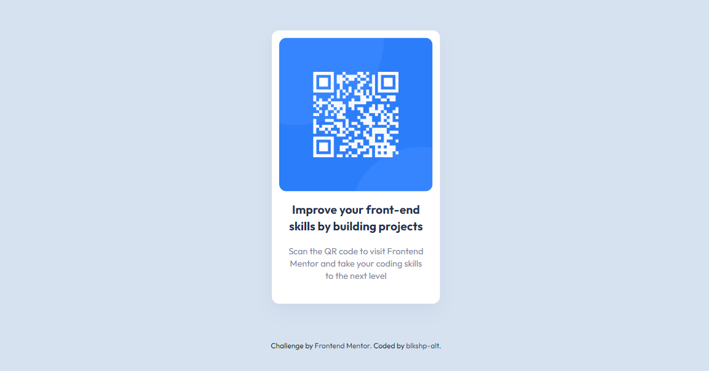

# Frontend Mentor - QR code component solution

This is a solution to the [QR code component challenge on Frontend Mentor](https://www.frontendmentor.io/challenges/qr-code-component-iux_sIO_H). Frontend Mentor challenges help you improve your coding skills by building realistic projects. 

## Table of contents

- [Overview](#overview)
  - [Screenshot](#screenshot)
  - [Links](#links)
- [My process](#my-process)
  - [Built with](#built-with)
  - [What I learned](#what-i-learned)
  - [Continued development](#continued-development)
- [Author](#author)
- [Acknowledgments](#acknowledgments)

## Overview

### Screenshot

### Links

- Live Site URL: [Add live site URL here](https://blkshp-alt-qr-code-component.netlify.app)

## My process

### Built with

- Semantic HTML5 markup
- CSS custom properties
- CSS Grid
- Mobile-first workflow

### What I learned

I've learned how powerful a tool grid is for building a responsive layout.

### Continued development

I'm going to continue learning to master the basics and get more profecent at building responsive layouts. 

## Author
- Frontend Mentor - [@blkshp-alt](https://www.frontendmentor.io/profile/blkshp-alt)

## Acknowledgments

Kevin Powell's YouTube videos are always extremely helpful for the frontend mentor css challenges.
